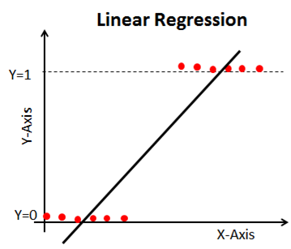

# Concept

## 1)로지스틱 회귀(Logistic Regression)

앞서 살펴본 선형회귀로는 회귀분석이 되지 않는 경우가 있다. 다음과 같은 경우가 대표적으로 선형회귀로 회귀분석이 되지 않는 경우이다.

이렇게 종속변수가 남자/여자, 성공/실패, 합격/불합격과 같이 0과 1로 자료가 표현될 수 있을 때, 이를 분류하기 위하여 로지스틱 회귀를 사용한다. 로지스틱 회귀를 사용하면 위 데이터가 다음과 같이 분석될 수 있다.

.png>)

로지스틱 회귀를 하기 위해서 우선 결괏값이 $$y\in \{0,1\}$$인 이진 분류 문제를 생각해보자. 선형모델이 생성한 예측값 $$z=\bold{w}^T\bold{x}+b$$는 실수이다. 따라서 실수 $$z$$를 0이나 1값으로 변환해줘야한다. 가장 이상적인 방법은 단위 계단 함수(Unit-Step Function)를 활용하는 것이다.

$$y=\begin{cases} 0, & \mbox{z}\mbox{<0;} \\ 0.5, & \mbox{z=0;} \\ 1, & \mbox{z}\mbox{>0;}  \end{cases}$$                eq.1

만약 예측값 $$z$$가 0보다 크다면 양성값으로, 0보다 작다면 음성값으로, 0아면 임의로 판별한다. 하지만 단위계단함수(Unit-Step Function)는 $$z=0$$에서 불연속이다. 그렇기 때문에 단위계단함수(Unit-Step Function)와 근사한 대체함수를 찾아야한다. 대체 함수로 로지스틱 함수가 자주 쓰이는 대체 함수이다.

$$y=\frac{1}{1+e^{-z}}$$                                   eq.2

로지스틱 함수는 일종의 시그모이드 함수(Sigmoid Function)로 $$z$$값을 0이나 1에 근사한 $$y$$값으로 전환하고, 결과가 $$z=0$$근처에서 급격하게 변화한다. 로지스틱 함수에 $$z = w^Tx+b$$를 대입하면 다음 식을 얻을 수 있다.

$$y = \frac{1}{1+e^{-(\bold{w}^T\bold{x}+b)}}$$                              eq.3

위 식은 다음 식으로 바꿀 수 있다.

$$ln\frac{y}{1-y} = \bold{w}^T\bold{x} +b$$                        eq.4

여기서 만약 $$y$$를 $$x$$가 양성값일 가능성으로 본다면, $$1-y$$는 음성값일 가능성이 된다. 그리고 이 둘의 비굣값을 오즈(Odds)라 부르고 형태가 다음과 같다.

$$\frac{y}{1-y}$$                                                  eq.5

오즈(Odds)는 $$x$$가 양성값일 상대적 가능성을 나타낸다. 오즈에 로그를 취하면 이를 로그 오즈(Log Odds)라고 부르고 로짓(Logit)이라고도 부른다.

$$ln\frac{y}{1-y}$$                                              eq.6

이러한 모델을 로지스틱 회귀(Logistic Regression)이나 로짓 회귀(Logit Regression)이라 부른다. 로지스틱 회귀는 명칭은 '회귀'이지만 일종의 분류 학습법이다.

eq.3의 $$\bold{w}$$와 $$b$$를 찾기 위해 만약 eq.3의 $$y$$를 사후 확률 $$p(y=1|x)$$라고 본다면 eq.4와 eq.3은 다음과 같이 써질 수 있다.

$$ln\frac{p(y=1|\bold{x}) }{p(y=0|\bold{x}) }=\bold{w}^T\bold{x}+b$$                    eq.7

$$p(y=1|\bold{x}) = \frac{e^{\bold{w}^T\bold{x}+b}}{1+e^{\bold{w}^T\bold{x}+b}}$$                    eq.8

따라서 eq.9가 나온다.

$$p(y=0|\bold{x}) = \frac{1}{1+e^{\bold{w}^T\bold{x}+b}}$$                      eq.9

결국 $$\bold{w}$$와 $$b$$를 추측하기 위해서 최대우도법(Maximum Likelihood Method)을 이용해야한다.

## 2) 최대 우도법

데이터 세트를 $$\{(x_i,y_i)\}^m_{i=1}$$로 정의하고, 로지스틱 회귀 모델이 로그 우도(Logistic Likelihood)를 최대화한다고 하면 eq.10과 같다.

$$l(\bold{w},b) = \underset{i=1}{\overset{m}\sum }ln  p(y_i | \bold{x}_i;\bold{w},b)$$               eq.10

즉, 각 샘플이 실제 레이블에 속할 확률이 높으면 높을수록 좋다는 뜻이다. 예를 들어, $$\boldsymbol{\beta} = (w;b)$$, $$\hat{\bold{x}} = (\bold{x}; 1)$$로 정의하면 $$\bold{w}^T\bold{x}+b$$는 $$\boldsymbol{\beta}^T\hat{\bold{x}}$$로 요약해서 쓸 수 있다. 또 $$p_1(\hat{\bold{x}};\beta)=p(y=1|\hat{\bold{x}};\beta)$$,$$p_0(\hat{x}; \beta)=p(y=0|\hat{x};\beta)$$로 정의한다면 eq.10에서 우도항을 다음과 같이 쓸 수 있다.

$$p(y_i|\bold{x}_i;\bold{w},b)=y_ip_1(\hat{\bold{x}}_i;\beta)+(1-y_i)p_0(\hat{\bold{x}}_i;\beta)$$         eq.11

eq.8과 eq.9에 기반하여 eq.11을 eq.10에 대입하면, eq.10을 최대화하는 것이 eq.12를 최소화하는 것과 같다는 것을 알 수 있다.

$$l(\beta) = \underset{i=1}{\overset{m}\sum}(-y_i\beta^T\hat{\bold{x}}_i+ln(1+e^{\beta^T\hat{\bold{x}}_i}))$$                          eq.12

eq.12는 $$\beta$$의 고차 미분 가능 연속 컨벡스 함수이다. 따라서 경사하강법이나 뉴턴법(Newton's Method)와 같은 최적화 알고리즘을 통해 최적해를 구할 수 있다.

$$\beta^*=\underset{\beta}{\argmin l(\beta)}$$                                eq.13

뉴턴법을 통해 최적해를 구하게 되면, t+1번째 순서의 반복해(Iteration Solution)의 공식은 eq.14이다.&#x20;

$$\beta^{t+1}=\beta^t-\left(\frac{\partial^2l(\beta)}{\partial\beta\partial\beta^T}\right )^{-1}\frac{\partial l(\beta)}{\partial\beta}$$               eq.14

eq.14의 $$\beta$$에 대한 1차, 2차 도함수는 각각 eq.15와 eq.16이다.&#x20;

$$\frac{\partial l(\beta)}{\partial\beta} =-\underset{i=1}{\overset{m}\sum}\hat{x}_i(y_i-p_1(\hat{x}_i;\beta))$$              eq.15

$$\frac{\partial^2l(\beta)}{\partial\beta\partial\beta^T}= \underset{i=1}{\overset{m}\sum}\hat{x}_i\hat{x}^T_ip_1(\hat{x}_i;\beta)(1-p_1(\hat{x}_i;\beta))$$      eq.16

eq.14를 통해 최소화하는 최적해를 찾고 이를 통해 $$w$$와 $$b$$를 추정한다.

## 참고문헌

단단한 머신러닝 / 제이펍 / 조우쯔화

[https://datascienceschool.net/03%20machine%20learning/10.01%20%EB%A1%9C%EC%A7%80%EC%8A%A4%ED%8B%B1%20%ED%9A%8C%EA%B7%80%EB%B6%84%EC%84%9D.html](https://datascienceschool.net/03%20machine%20learning/10.01%20%EB%A1%9C%EC%A7%80%EC%8A%A4%ED%8B%B1%20%ED%9A%8C%EA%B7%80%EB%B6%84%EC%84%9D.html)
